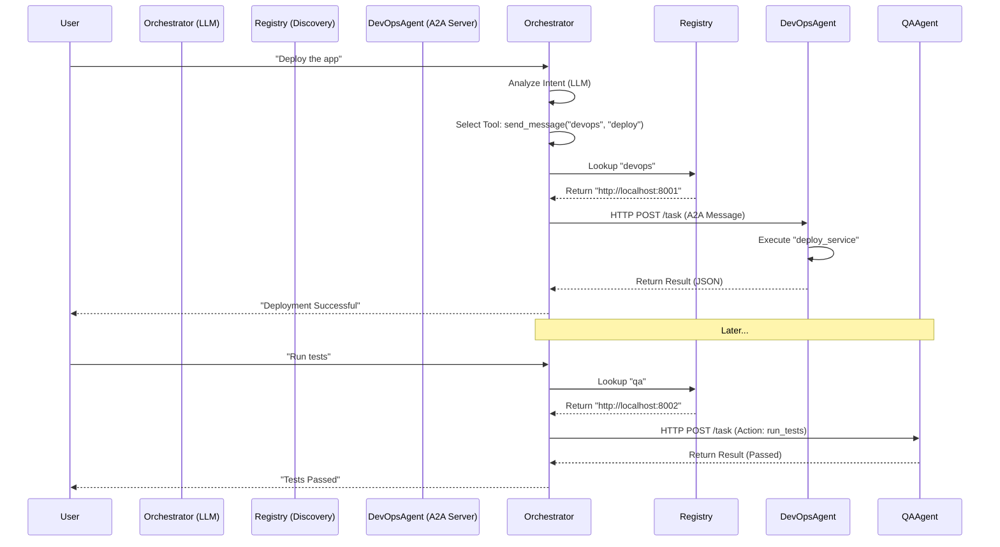

# Multi-Agent Orchestration System

This project implements a production-ready **Multi-Agent System (MAS)** designed to automate the lifecycle of the `snapstock` application. It leverages **Google's Agent Development Kit (ADK)** and the **Agent-to-Agent (A2A)** communication protocol to create a distributed network of specialized AI agents.

## System Architecture

The system is architected as a set of independent microservices, where each "Agent" runs as a distinct process. This decoupling allows for scalability and independent scaling of capabilities.

### The Agent Hierarchy

The system consists of three primary agents:

1.  **Orchestrator Agent (The "Brain")**
    *   **Role**: Acts as the central controller and interface for the user.
    *   **Responsibility**: It does not perform low-level tasks itself. Instead, it interprets user intent (e.g., "Deploy the app") and delegates the work to the appropriate specialist agent.
    *   **Technology**: Uses a Large Language Model (Gemini) to reason about which tool to call.

2.  **DevOps Agent (The "Builder")**
    *   **Role**: A specialized worker focused on infrastructure and deployment.
    *   **Capabilities**:
        *   `build_image`: Compiles the application code into a Docker container.
        *   `deploy_service`: Updates the Cloud Run service with the new image.
    *   **Definition**: Defined in `agents/devops/agent.py`. It wraps Python functions as ADK Tools and exposes them via an A2A Server.

3.  **QA Agent (The "Tester")**
    *   **Role**: A specialized worker focused on quality assurance.
    *   **Capabilities**:
        *   `run_tests`: Executes automated test suites (Frontend/Backend).
    *   **Definition**: Defined in `agents/qa/agent.py`. It exposes testing functions as A2A-callable tools.

## How the Orchestrator Functions

The Orchestrator is the most complex component. Its operation can be broken down into two layers:

### 1. Cognitive Layer (Intent Recognition)
The Orchestrator is initialized with a system instruction:
> *"You are an Orchestrator. Your goal is to manage deployments and testing by delegating to specialized agents."*

When a user sends a command like *"Please deploy the latest version"*, the embedded LLM (Gemini) analyzes this text. It recognizes that "deploy" matches the semantic purpose of the **DevOps Agent**.

### 2. Execution Layer (Delegation)
Once the intent is understood, the Orchestrator needs to technically communicate with the DevOps Agent.
1.  **Tool Call**: The LLM generates a function call to its internal tool `send_message(agent_name="devops", action="deploy_service")`.
2.  **Service Discovery**: The Orchestrator looks up "devops" in its internal registry to find the agent's network address (e.g., `http://localhost:8001`).
3.  **A2A Protocol**: It constructs a structured A2A message containing the task details and sends it over HTTP to the DevOps Agent.
4.  **Response Handling**: The DevOps Agent executes the task and returns a result, which the Orchestrator then summarizes back to the user.

### Logic Flow Diagram



## Running the System

To run this distributed system locally, you must start each agent in its own terminal process to simulate a real microservices environment.

### Prerequisites
*   Google Cloud Project with Vertex AI enabled.
*   Python 3.10+ installed.
*   Dependencies installed via `source setup.sh`.

### Startup Command
**Terminal 1 (DevOps Service):**
```bash
python3 agents/devops/agent.py
```

**Terminal 2 (QA Service):**
```bash
python3 agents/qa/agent.py
```

**Terminal 3 (Orchestrator):**
```bash
python3 agents/orchestrator/agent.py
```

Once all three are running, you can interact with the Orchestrator in Terminal 3. Try commands like:
*   *"Deploy the application"*
*   *"Run a full system check"*
